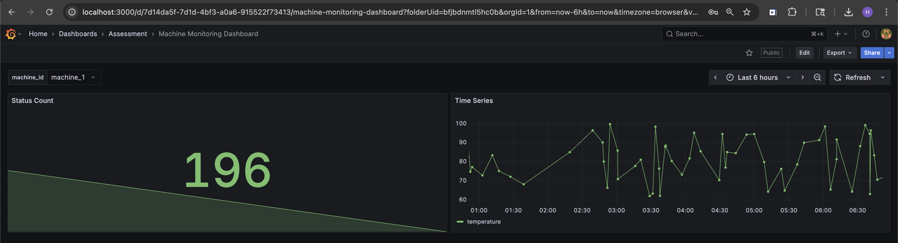

# Grafana Data Engineer Assignment

---

## 📌 Overview

This project demonstrates a minimal yet production-oriented Grafana integration pipeline using PostgreSQL as the data source. The focus is on clean data flow, practical visualization, and integration-ready system design.

The solution is divided into:

* **Part A**: Working Grafana dashboard with PostgreSQL
* **Part B**: Integration of Grafana into an on-premise CMMS product

---

## ⚙️ Tech Stack

* Grafana (Visualization Layer)
* PostgreSQL (Data Storage)
* Python (Data Simulation - optional)
* macOS Local Setup

---

# 🔹 PART A — Visualization Implementation

---

## 🔄 Data Flow

```
Data Generator (Python / SQL)
        ↓
PostgreSQL Database
        ↓
Grafana (via PostgreSQL Data Source)
        ↓
Dashboard Visualization
```

---

## 🗄️ Database Setup

### Create Database

```sql
CREATE DATABASE grafana_demo;
```

### Create Table

```sql
CREATE TABLE machine_metrics (
    id SERIAL PRIMARY KEY,
    machine_id TEXT,
    status TEXT,
    temperature FLOAT,
    timestamp TIMESTAMP
);
```

---

## 📊 Data Generation

Synthetic data was generated using PostgreSQL:

```sql
INSERT INTO machine_metrics (machine_id, status, temperature, timestamp)
SELECT
  'machine_' || (1 + floor(random() * 5))::int,
  CASE 
    WHEN random() > 0.8 THEN 'failed'
    ELSE 'running'
  END,
  60 + random() * 40,
  NOW() - (random() * interval '24 hours')
FROM generate_series(1, 1000);
```

---

## 📈 Grafana Dashboard

### Dashboard Name:

**Machine Monitoring Dashboard**

### Panels

1. **Machine Status Distribution**

   * Type: Bar Chart
   * Displays count of machines grouped by status

2. **Temperature Trend Over Time**

   * Type: Time Series
   * Supports filtering via machine variable

3. **Average Machine Temperature**

   * Type: Stat Panel

---

## 🎛️ Variables

* `machine`

```sql
SELECT DISTINCT machine_id FROM machine_metrics;
```

---

## 🖼️ Dashboard Preview



---

## 🔌 Integration Readiness

This implementation is designed with integration in mind:

* PostgreSQL acts as a shared data layer
* Grafana is kept as a separate visualization service
* Dashboard supports dynamic filtering via variables

---

## 🚀 How to Run

1. Start PostgreSQL
2. Create database and table
3. Insert sample data
4. Start Grafana:

   ```
   brew services start grafana
   ```
5. Open http://localhost:3000
6. Add PostgreSQL data source
7. Import dashboard JSON from `/dashboards`

---

# 🔹 PART B — Grafana Integration Design (CMMS)

---

## 🎯 Objective

Design how Grafana can be integrated into an on-premise CMMS (Computerized Maintenance Management System) to provide seamless monitoring capabilities.

---

## 🏗️ Architecture Overview

```
[ User (Browser) ]
        ↓
[ CMMS Frontend ]
        ↓
[ CMMS Backend (API Layer) ]
        ↓ (Reverse Proxy + Auth)
[ Grafana Server ]
        ↓
[ PostgreSQL Database ]
```

---

## 🧩 Component Responsibilities

### CMMS Frontend

* Primary user interface
* Provides navigation (e.g., Monitoring section)
* Embeds Grafana dashboards via iframe

### CMMS Backend

* Handles authentication and session management
* Acts as a reverse proxy for Grafana
* Injects authentication tokens

### Grafana

* Visualization layer
* Queries PostgreSQL
* Renders dashboards

### PostgreSQL

* Stores machine and operational data
* Serves as a central data layer

---

## 🔌 Integration Approach

### Selected Approach:

**Hybrid (Reverse Proxy + iframe embedding)**

---

### How It Works

1. User accesses monitoring page in CMMS
2. CMMS embeds Grafana dashboard using iframe
3. Requests are routed through backend reverse proxy
4. Authentication context is injected
5. Grafana renders dashboards securely

---

### Why This Approach

* Seamless user experience (no context switching)
* Centralized authentication control
* No modification to Grafana core
* Suitable for production environments

---

### Tradeoffs

| Approach               | Pros     | Cons                  |
| ---------------------- | -------- | --------------------- |
| iframe only            | Simple   | Security limitations  |
| API-based              | Flexible | High complexity       |
| Reverse Proxy + iframe | Balanced | Slight setup overhead |

---

## 🔐 Authentication Design

### Method:

**JWT-based Single Sign-On (SSO)**

---

### Authentication Flow

```
1. User logs into CMMS
2. CMMS backend generates JWT token
3. User navigates to monitoring page
4. Request passes through reverse proxy
5. Token is validated by Grafana
6. Dashboard loads without additional login
```

---

### Security Considerations

* Centralized authentication in CMMS
* Grafana not exposed publicly
* Token-based access control
* HTTPS enforced
* Role-based access control (RBAC)

---

## 👤 User Access Flow

```
Login → CMMS Dashboard → Monitoring → Embedded Grafana Dashboard
```

---

## 🧩 Component Separation

| Component     | Type        |
| ------------- | ----------- |
| Grafana       | Open Source |
| CMMS          | Proprietary |
| Backend Proxy | Proprietary |
| PostgreSQL    | Open Source |

---

## 🧠 Data Flow in Integrated System

```
System / Machines → Data Ingestion → PostgreSQL
Grafana → Query PostgreSQL → Render Dashboards
User → Access via CMMS → View Insights
```

---

## 🔐 Design Principles

* Loose coupling between components
* Grafana used as independent service
* No modification to Grafana core (AGPL-safe)
* Backend-controlled access layer
* Separation of concerns

---

## 🚀 Scalability Considerations

* Grafana can scale independently
* PostgreSQL can be optimized or replaced (e.g., time-series DB)
* Backend proxy can handle routing and access control

---

# 📁 Deliverables

* Dashboard JSON: `/dashboards/machine-monitoring-dashboard.json`
* SQL Setup: `/data/sample_data.sql`
* Screenshot: `/screenshots/part_a.png`

---

# 💡 Notes

* Focused on simplicity, clarity, and production readiness
* Avoided over-engineering while maintaining scalability
* Designed with real-world integration scenarios in mind

---
